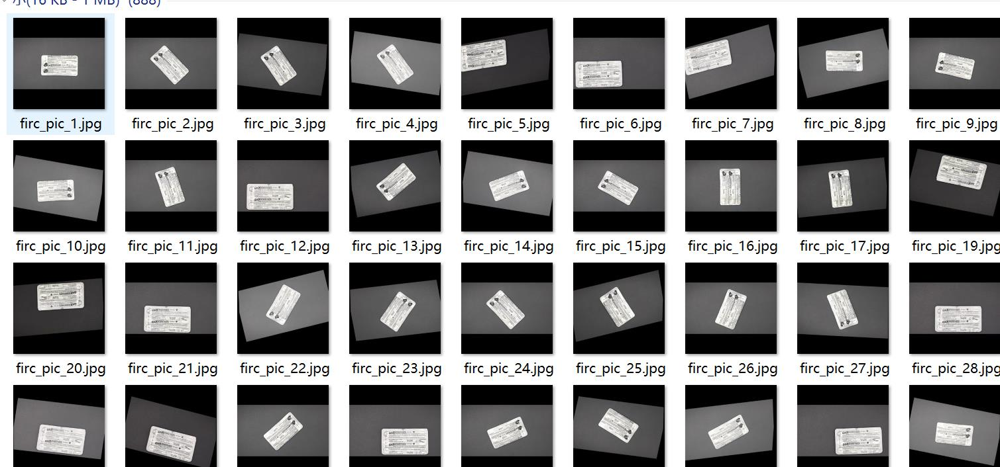
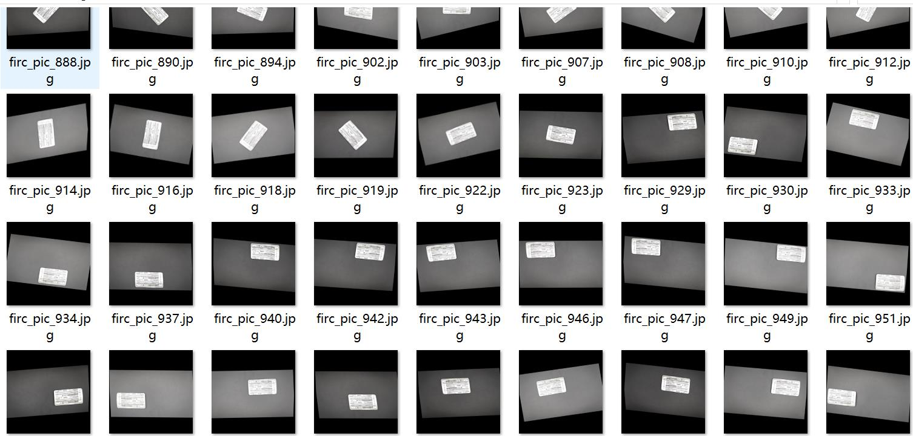
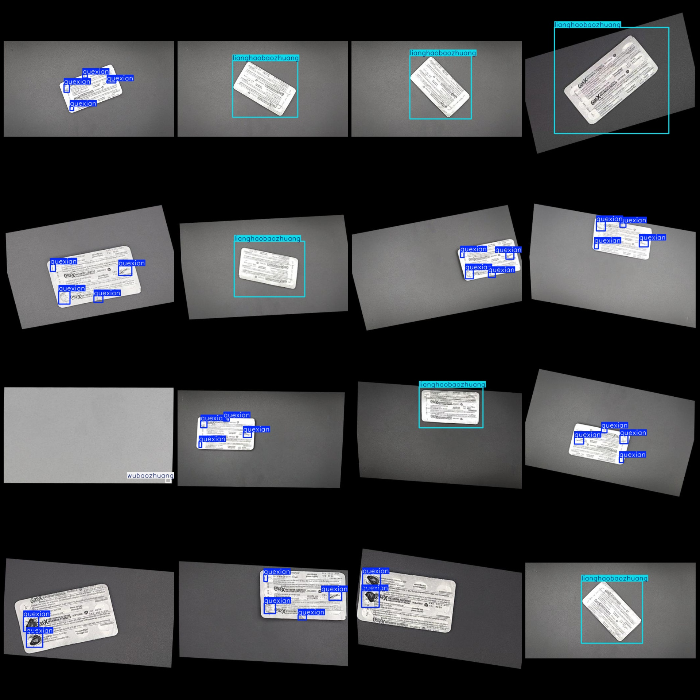
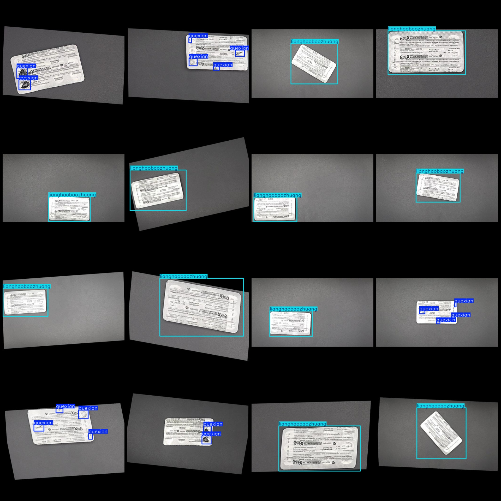

# Medicine Packaging Defect Detection Dataset VOC+YOLO format with 1211 images and 3 categories enhanced

Please note that in the dataset, approximately 500 images are original images, and the remaining are enhanced images. Please refer to image for more details.
Dataset format: Pascal VOC format + YOLO format (without split path txt files, only containing jpg images and corresponding VOC format xml files and yolo format txt files)
Number of images (jpg file count): 1211
Number of xml files: 1211
annotation count: 1211  
annotationnumber of classes: 3  
Annotation class names (Note that the order of YOLO format classes does not correspond to this, but is based on the labels file with `classes.txt`): ["lianghaobaozhuang", "quexian", "wubaozhuang"]
boxes per class:   
Lianghaobaozhuang (Good Packaging) Frames = 548
Quexian (defects, such as cracks, blisters, etc.) box count = 2156
Wubaozhuang (preventing false detection random boxes) box count = 49
total boxes: 2753  
images per class:   
lianghaobaozhuang images = 548  
Queian's possession of images = 614.
wubaozhuang images = 49  
image resolution: 512x512  
Use the labeling tool: LabelImg
Annotation Rule: Draw a rectangle around the class for each instance.
Special Notes: The dataset does not have separate training, validation, and test sets; you need to manually divide them.
Special Statement: This dataset does not guarantee the accuracy of the trained model or weight file.
Image preview:
annotation example:
## Images

Here is a pay link on Stripe ( https://buy.stripe.com/3cs8yP7sY87d0vu9AB ). Please contact me lonlonago@foxmail.com after funding $89, and I will send you a complete data files , thank you!

